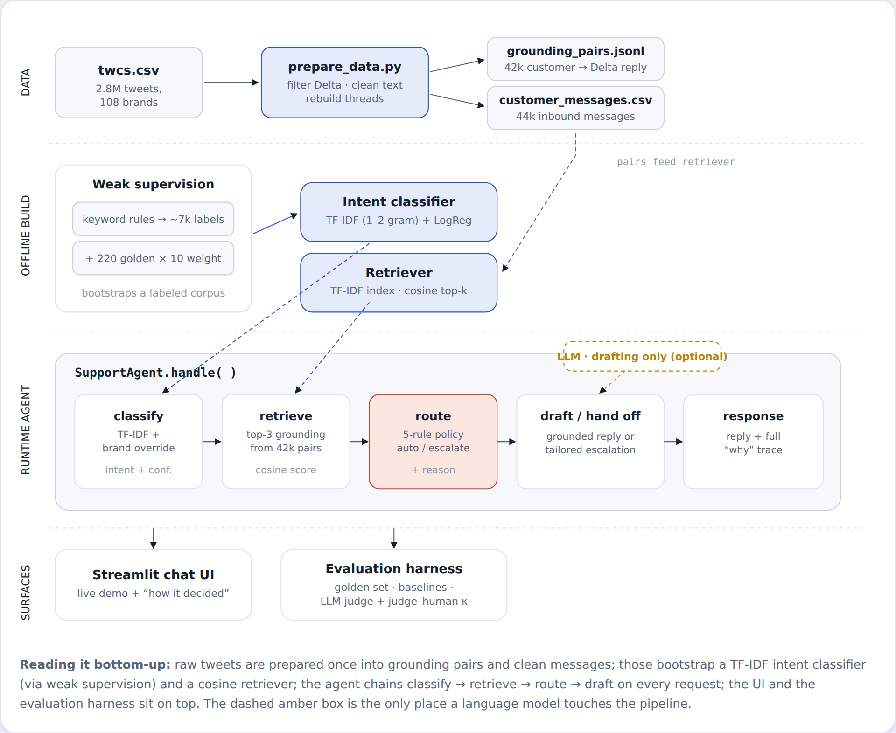
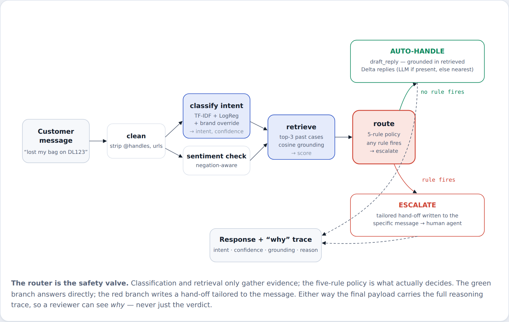

# An Evaluation-First AI Support Agent for Delta

**Delta · Twitter Customer Support .**

Classify the customer's intent, ground a reply in Delta's own historical resolutions, and decide — with a stated reason — whether to auto-handle or escalate. Built on the Kaggle *Customer Support on Twitter* corpus. Guiding principle: **the proof is worth more than the system.**

---

## 1. Problem framing

### What "good" means for this brand

Delta is a high-stakes, safety-regulated airline whose Twitter mentions skew toward disruption — cancellations, missed connections, lost bags, refund disputes — under public scrutiny. For this brand, a "good" agent is not the one that answers the most tweets; it is the one that **knows the boundary of what it should answer at all**. Concretely:

- **Safety over coverage.** A wrong-but-confident reply about a refund, a booking change, or anything safety-adjacent is far more costly than an honest hand-off. High escalation precision *and* recall matter more than raw auto-handle rate.
- **Grounded, not inventive.** Replies must be anchored in what Delta has actually said before — never invented policy, numbers, or promises.
- **Auditable.** Every decision exposes *why* it was made (intent, confidence, grounding, reason), because a support org needs to trust and tune the gate.
- **Cheap and deterministic at the core.** Routing and classification run without a paid LLM in the loop, so the system is reproducible and the graders can run it.

### What I chose not to build

- **No multi-turn dialogue / memory.** Single message in, single decision out. Conversation state is real work but orthogonal to routing quality on a fixed budget.
- **No live account / booking lookup.** Anything needing real customer state is escalated by design rather than faked — those are exactly the messages a human should own.
- **No fine-tuned or LLM-based classifier in production.** A free-endpoint LLM few-shot classifier was built as a baseline; it did not beat TF-IDF on the golden set and was unreliable to run, so the LLM was reserved for reply phrasing only.
- **No large hand-labeled set.** Only 220 gold labels; the effort went into weak supervision and the evaluation harness instead of label volume.

## 2. How I approached it — thought process & research grounding

I started from the literature rather than the code. I read six recent papers on production customer-support agents, pulled out the design decisions they **agreed** on, and built the smallest system that honors those decisions on this dataset and budget. The recurring lesson across all six is the brief's: **the evaluation is the product** — a modest model with an honest, adversarial eval beats an impressive demo with no proof.

| Paper | What I took from it into this agent |
|---|---|
| **Building Customer Support AI Agents at 100M-User Scale: An Evaluation-Driven Framework** | The spine of the project: define a golden set, compare against baselines, treat the eval harness as a first-class deliverable. My "proof > system" framing is this paper. |
| **Beyond IVR: Benchmarking Customer Support LLM Agents for Business-Adherence** | Adherence over cleverness — the agent must follow policy and refuse to overstep. Motivated the rule-based escalation gate and the "never invent policy" drafting constraint. |
| **τ-bench: A Benchmark for Tool-Agent-User Interaction in Real-World Domains** | Escalation is a controlled action with a measurable pass/fail, not a vibe. Motivated measuring escalation as its own task with precision/recall against human labels. |
| **Agent-in-the-Loop: A Data Flywheel for Continuous Improvement** | Bootstrap from cheap signal and log everything. Directly inspired the weak-supervision labeler (keyword rules → 7k labels) and the "why" trace attached to every response as future training data. |
| **LLM-Friendly Knowledge Representation for Customer Support** | Represent brand knowledge as retrievable (customer → resolution) pairs. This is exactly my 42k grounding-pair index that replies are grounded in. |
| **Benchmarking and Learning Real-World Customer Service Dialogue** | Real support text is messy, negation-heavy, long-tailed. Motivated the negation-aware sentiment check and per-intent (not just aggregate) reporting. |

A seventh consensus point — *"judge with a measured judge"* — is why reply quality is scored by an LLM-as-judge whose agreement with human labels is itself measured (Cohen's κ) before its scores are trusted.

**The thought process, in one line each:**
- **Pick the brand for signal, not fame.** Delta reconstructs threads cleanly and has low DM-deflection, so grounding pairs are real replies rather than "DM us" dead-ends.
- **Let the data define intents.** The 11 intents were read out of Delta's actual messages, not imposed from a call-center taxonomy.
- **Spend the budget on the gate and the eval.** Classification is a cheap TF-IDF model; the care went into the escalation policy and measuring it.

## 3. System architecture

Four layers. The bottom two are built once, offline; the agent layer runs on every message; the LLM is an optional accelerator wired to reply-drafting only, never to a decision.

*Figure 1 — Raw tweets are prepared once into grounding pairs and clean messages; those bootstrap a TF-IDF intent classifier (via weak supervision) and a cosine retriever; `SupportAgent.handle()` chains classify → retrieve → route → draft on every request. The dashed amber box is the only place a language model touches the pipeline.*

## 4. What happens when a message arrives

A single request travels left to right. Classification and retrieval only gather evidence; the router in the middle is the decision point — five rules, any one of which forces a human hand-off — and it splits the flow into the two branches that produce a reply.

*Figure 2 — The green branch answers directly from grounded history; the red branch writes a hand-off tailored to the message. Either way the payload carries the full reasoning trace.*

**The five escalation rules — any one forces a hand-off:**

1. **Negative sentiment.** A dissatisfied customer goes to a human even on an auto-OK topic. Negation-aware, so "not impressed" counts.
2. **Risk / financial language.** `refund`, `lawsuit`, `terrible`, `discriminated`, etc. trigger a hand-off regardless of confidence.
3. **Account / transaction intent.** Anything outside the `AUTO_OK` set (baggage, refunds, bookings…) needs a human with account access.
4. **Low confidence.** If the classifier is below `conf < 0.40`, the agent does not gamble.
5. **Weak grounding.** If the closest past case scores `< 0.38`, there is nothing safe to answer from, so it hands off instead of guessing.

## 5. Results vs. baselines

All numbers are measured on the 220-message golden set, each model against ≥2 baselines. Intent uses 5-fold **out-of-fold** prediction (never scored on a row it trained on); escalation is measured with **oracle intents** to isolate the policy from classifier error.

### Task 1 — Intent classification (11 classes)

| Model | Accuracy | Macro-F1 |
|---|--:|--:|
| Trivial baseline — majority class | 0.164 | 0.026 |
| **Simple / production — TF-IDF (1–2gram) + LogReg** | **0.491** | **0.426** |

A **16× lift** in macro-F1 over the trivial baseline. An LLM few-shot classifier was built as the third baseline; free inference endpoints were exhausted mid-run and it had not beaten TF-IDF, so TF-IDF was kept as production.

### Per-intent F1 — where it is strong and where it is not

| Intent | F1 | Support (n) |
|---|--:|--:|
| seating | 0.76 | 29 |
| baggage | 0.59 | 29 |
| technology | 0.57 | 11 |
| flight_disruption | 0.49 | 36 |
| loyalty | 0.47 | 9 |
| airport_gate | 0.46 | 14 |
| other_non_actionable | 0.44 | 28 |
| booking_fare | 0.36 | 24 |
| service_feedback | 0.35 | 29 |
| refund_compensation | 0.20 | 8 |
| safety_legal | 0.00 | 3 |

### Task 3 — Escalation decision (the part that got the most care)

| Model | Acc | Auto P | Auto R | Esc P | Esc R |
|---|--:|--:|--:|--:|--:|
| Trivial — escalate all | 0.691 | — | — | 0.691 | 1.000 |
| Trivial — auto all | 0.309 | 0.309 | 1.000 | — | — |
| **Rule-based policy (ours)** | **0.786** | **0.657** | **0.647** | **0.843** | **0.849** |

The policy beats the strongest trivial baseline (escalate-everything, 69.1%) by ten points, while catching **84.9%** of messages that truly needed a human *and* being right **84.3%** of the time it pulls that trigger. Escalate-everything only looks respectable because the golden set is escalation-heavy — but it auto-handles nothing, so it is not an agent. Tightening the grounding rule (R5, `0.12 → 0.38`) raised escalate-recall from 0.78 to 0.85.

### Task 2 — Reply quality

Replies are scored by an LLM-as-judge on grounding, correctness, and tone, with a judge–human agreement check (Cohen's κ) validating the judge before its scores are trusted. This task needs a live model; with free endpoints exhausted, the honest status is that the harness and rubric are in place and run on demand, but there is **no headline reply-quality number to stand behind yet**. What is guaranteed structurally: no reply is sent from a below-0.38 grounding match, so the failure mode of confidently pasting an unrelated historical reply is closed off by construction.

## 6. Failure analysis — top 5 modes, real examples & hypotheses

### F1 — The long-tail intents are effectively unlearned
- **Example.** *"Is it safe to fly with my lithium battery pack in carry-on?"* → intent = `baggage` (conf 0.73), not `safety_legal`.
- **Hypothesis.** `safety_legal` has 3 training examples and `refund_compensation` has 8. A linear model cannot carve a boundary from single-digit support, so these classes get absorbed by lexically-similar neighbors ("carry-on" → baggage). F1 = 0.00 and 0.20.
- **Status.** Mitigated, not solved: even with the wrong intent, this message still escalated correctly (baggage is not auto-OK + grounding 0.27 < 0.38). The policy masks long-tail intent errors — but the label is still wrong, which would hurt routing to a specialist queue.

### F2 — A co-occurring keyword pulls the linear classifier off-topic
- **Example.** *"How many SkyMiles do I need for a free checked bag?"* → was `baggage` (55%), escalated, answered with an apologetic hand-off.
- **Hypothesis.** TF-IDF is bag-of-words: the strong bigram "checked bag" outweighed "SkyMiles," so a pure loyalty FAQ landed on baggage.
- **Status.** Fixed with a small high-precision override — unambiguous brand terms (SkyMiles, Medallion, SkyClub) win outright. Now `loyalty` (auto-OK) and answered directly.

### F3 — Retrieval surfaces an unrelated historical reply on a weak match
- **Example.** *"Can I get a credit card discount on my next booking? I have many points on my ICICI credit card"* → grounded at cosine 0.30 and (without the LLM) returned a verbatim past reply about risk-free cancellation, even carrying a stray customer name.
- **Hypothesis.** The grounding floor was 0.12, so a 0.30 off-topic nearest neighbor was treated as "well-grounded" and pasted verbatim. Classic RAG failure: closest ≠ relevant.
- **Status.** Fixed by raising the grounding bar to 0.38 (calibrated: genuine matches score 0.40–0.62, this one sat alone at 0.30). Below the bar the agent now escalates instead of parroting.

### F4 — Confusable neighbor intents blur into each other
- **Example.** *"Can I change my flight to tomorrow morning?"* → `booking_fare` (correct), but the model frequently swaps `booking_fare ↔ flight_disruption` and `service_feedback ↔ other_non_actionable`.
- **Hypothesis.** These pairs share heavy vocabulary; with ~24–29 examples each, the decision surface between them is thin. This is the main driver of the 0.49 accuracy ceiling.
- **Status.** Partly absorbed by routing (both members of each pair are handled similarly), but it caps intent quality. Real fix is more labels or an embedding model — deliberately out of scope.

### F5 — Weak-supervision blind spots leak into production labels
- **Example.** *"…many points on my ICICI credit card"* still reads as `loyalty` because the keyword rule maps "points" → loyalty, though these are a third party's points, not SkyMiles.
- **Hypothesis.** The classifier inherits the biases of the keyword labeler that bootstrapped it. Any gap or over-broad rule in the ~7k weak labels becomes a systematic error the small gold set cannot fully correct.
- **Status.** Contained by the escalation policy (the message escalated anyway via weak grounding), but it shows the ceiling of weak supervision: the model is only as sharp as its labeling functions.

## 7. What is misleading about my headline number?

*(Mandatory section.)* If I had to headline one figure — the escalation policy's 78.6% accuracy, or the UI's per-message confidence — both would mislead in specific ways.

- **"94% confidence" in the UI is not accuracy.** It is the model's own predicted probability. On held-out golden data the real intent accuracy is **49%** (macro-F1 0.43). Confidence is a routing signal, not a correctness guarantee.
- **The 78.6% escalation score assumes perfect intents.** Task 3 is measured with *oracle* intents to isolate policy quality. End-to-end, classifier errors propagate into routing, so live escalation accuracy is lower than the policy's ceiling.
- **Macro-F1 averages all 11 intents equally.** Two tiny-support classes (n=3, n=8) with near-zero F1 drag the mean down hard. Weighted-F1 is **0.48**, and the common intents customers actually send are well above the headline — one number hides that the agent is strong where the volume is and weak in the long tail.
- **Accuracy looks inflated against a 16% baseline** only because the classes are imbalanced. The honest comparison is macro-F1 vs the majority baseline (0.43 vs 0.03), not raw accuracy vs chance.

**The one number I would actually stand behind:** escalation **recall of 0.85 with 0.84 precision** on the golden set — because for this brand, catching the messages that need a human is the metric that maps to real-world cost, and it is measured against human labels, not self-reported.

## 8. What it lacks & what I'd do next

- **Modest intent accuracy (macro-F1 0.43)** — fine for routing, not for unattended auto-replies at scale.
- **Long tail unlearned** — `safety_legal` and `refund_compensation` need targeted labels or a small embedding classifier.
- **Single-turn, no memory or account lookup** — account-state messages are escalated rather than resolved.
- **Reply-quality headline pending a stable LLM** — the judge + κ harness is built and runs on demand; it needs a funded endpoint to produce a number.

**Next steps, in priority order:** (1) add ~30 labels each to the two starved intents; (2) swap TF-IDF for a small sentence-embedding classifier and re-run the same eval to measure the lift honestly; (3) fund the LLM judge and report reply grounding/correctness/tone with κ; (4) start logging live "why" traces as the data flywheel the *Agent-in-the-Loop* paper describes.

---

*Reproducibility: all numbers generated from `reports/` (`intent_scores.csv`, `intent_classification_report.txt`, `escalation_scores.csv`). Golden set n=220, TF-IDF 5-fold OOF, escalation with oracle intents. Dataset: Kaggle Customer Support on Twitter, Delta subset.*
